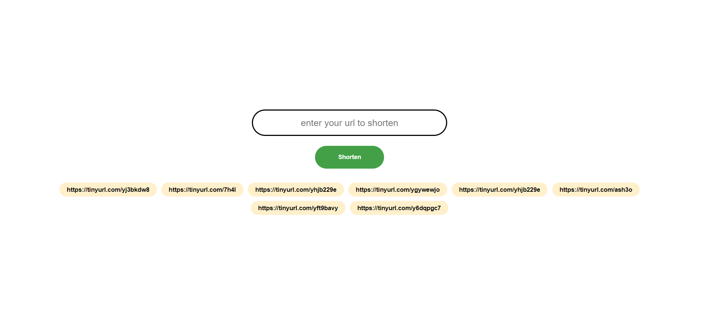

# urls-shortener-cra
This is a React implementation for a custom url shortener with copy to clipboard functionality and persisting urls histry with redux.




> Made with love by React, Typescript, Emotion Js, Tinyurl, Redux, Redux Persist, Yup and Formik.

#### Steps to run locally
```
git clone https://github.com/robertkibet/urls-shortener-cra.git
cd urls-shortener-cra
yarn install
yarn start
```
voila!!! :tada:

--- 

:smile: :tada: find me on [twitter](https://twitter.com/realrobertkibet) :zap: